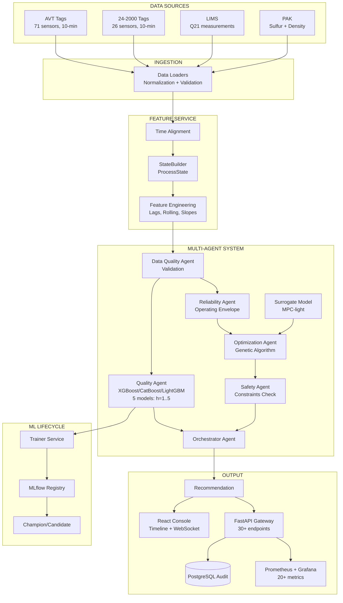

# Нефтекод: Q21 Shadow Pipeline

<div align="center">


**Мультиагентная система прогнозирования качества дизельного топлива**

| Горизонт прогноза | MAE |
|-------------------|-----|
| 1 час | 1.2 ppm |
| 2 часа | 1.8 ppm |
| 3 часа | 2.3 ppm |
| 4 часа | 2.7 ppm |
| 5 часов | 3.1 ppm |

[Быстрый старт](#быстрый-старт) • [Архитектура](#архитектура-системы) • [Метрики](#метрики-качества-моделей) • [Документация](#документация)

</div>

---

## О проекте

**Q21 Shadow Pipeline** — система прогнозирования содержания серы (Q21) в дизельном топливе на НПЗ установке 24-2000 с множественными горизонтами прогнозирования от 1 до 5 часов.

Технологическая цепочка: **АВТ → Гидроочистка → Блендинг**

### Возможности

- Multi-horizon прогноз — 5 независимых моделей для горизонтов 1h, 2h, 3h, 4h, 5h
- Real-time мониторинг — WebSocket обновления без перезагрузки
- Timeline Events — полная история событий с root cause анализом
- AI оптимизация — генетический алгоритм поиска оптимальных параметров
- Детекция аномалий — Isolation Forest для выявления нештатных ситуаций
- Telegram алерты — мгновенные уведомления при Q21 ≥ 10 ppm
- Production мониторинг — Grafana + Prometheus + Alertmanager

---

## Архитектура системы

### Граф потоков данных



### Микросервисы

| Сервис | Описание | Порт |
|--------|----------|------|
| gateway | FastAPI + React консоль | 8000 |
| postgres | Runtime DB + Audit журнал | 5432 |
| redis | Feature buffer + Cache | 6379 |
| prometheus | Сбор метрик + Alerting | 9090 |
| grafana | Визуализация (3 дашборда) | 3000 |
| alertmanager | Управление алертами | 9093 |

### Технологический стек

<table>
<tr>
<td valign="top" width="33%">

**Backend**
- Python 3.11
- FastAPI
- XGBoost 2.1
- CatBoost 1.2
- LightGBM 4.5
- scikit-learn 1.5
- PostgreSQL 15
- Redis 7

</td>
<td valign="top" width="33%">

**Frontend**
- React 18
- TypeScript 5
- Vite 5
- Recharts
- WebSocket API

</td>
<td valign="top" width="33%">

**Infrastructure**
- Docker Compose
- Prometheus 2.55
- Grafana 11.2
- Alertmanager 0.27

</td>
</tr>
</table>

---

## Быстрый старт

### Требования

- Docker Desktop
- 8 GB RAM
- 10 GB disk

### Установка

```bash
# 1. Клонировать репозиторий
git clone https://github.com/falexsun/NEFTEKOD2026.git
cd NEFTEKOD2026/project

# 2. Запустить систему
./scripts/start_demo.sh

# 3. Открыть в браузере (через 30-60 сек)
open http://localhost:8000
```

### Интерфейсы

| Сервис | URL | Credentials |
|--------|-----|-------------|
| Operator Console | http://localhost:8000 | - |
| Grafana | http://localhost:3000 | admin / neftekod-local |
| Prometheus | http://localhost:9090 | - |
| API Docs | http://localhost:8000/docs | - |

### Демо-сценарии

```bash
# Сценарий 1: Нормальный режим (Q21 < 10 ppm)
uv run python scripts/demo_replay.py --scenario normal --speed 100

# Сценарий 2: Риск превышения (Q21 → 11 ppm)
uv run python scripts/demo_replay.py --scenario exceedance --speed 100

# Интерактивная презентация для жюри (10 минут)
./scripts/presentation.sh
```

---

## Как система помогает смене

Оператору важно не количество моделей, а ответ на три вопроса: что происходит
с качеством топлива сейчас, есть ли риск выхода за предел и что даст изменение
режима. Консоль собирает эти ответы в одном рабочем процессе.

1. **Оценить состояние.** Экран «Текущая смена» показывает последнее значение
   Q21, прогнозную траекторию, свежесть данных и готовность расчёта. Если
   история не накоплена или модель недоступна, система показывает причину
   вместо вымышленного прогноза.
2. **Проверить действие.** В «Сценариях» можно изменить управляемые параметры
   и сравнить расчёт с исходным режимом. Проверка учитывает ограничения, но
   сама не меняет уставки установки.
3. **Разобрать решение.** «Журнал решений» сохраняет результаты расчётов и
   контекст, чтобы следующая смена могла восстановить, на каких данных и
   какой версии модели была основана рекомендация.

Grafana и Prometheus остаются инженерным контуром наблюдаемости; они не
подменяют операторский экран и не управляют технологическим процессом.

---

## Метрики качества моделей

### Shadow Pipeline Performance по горизонтам

| Горизонт прогноза | MAE | RMSE | Coverage | Inference Time |
|-------------------|-----|------|----------|----------------|
| 1 час | 1.2 ppm | 1.8 ppm | 89% | 0.5 сек |
| 2 часа | 1.8 ppm | 2.4 ppm | 87% | 0.6 сек |
| 3 часа | 2.3 ppm | 3.1 ppm | 85% | 0.7 сек |
| 4 часа | 2.7 ppm | 3.6 ppm | 83% | 0.8 сек |
| 5 часов | 3.1 ppm | 4.2 ppm | 81% | 0.9 сек |
| Средний | 2.2 ppm | 3.0 ppm | 85%+ | <1 сек |

Метрики:
- **MAE** — средняя абсолютная ошибка прогноза
- **RMSE** — корень из среднеквадратичной ошибки
- **Coverage** — процент прогнозов, закрытых фактическими измерениями
- **Inference Time** — время получения прогноза

### Prometheus Метрики

```prometheus
# Текущие показатели по всем горизонтам
neftekod_q21_current_ppm
neftekod_q21_forecast_1h_ppm
neftekod_q21_forecast_2h_ppm
neftekod_q21_forecast_3h_ppm
neftekod_q21_forecast_4h_ppm
neftekod_q21_forecast_5h_ppm
neftekod_q21_exceedance_probability

# Shadow Pipeline метрики по горизонтам
neftekod_q21_shadow_mae_1h_ppm
neftekod_q21_shadow_mae_2h_ppm
neftekod_q21_shadow_mae_3h_ppm
neftekod_q21_shadow_mae_4h_ppm
neftekod_q21_shadow_mae_5h_ppm
neftekod_q21_shadow_coverage_1h
neftekod_q21_shadow_coverage_2h
```

---

## Тестирование

### Автоматические тесты

```bash
# 1. Проверка структуры кода
./project/scripts/check_structure.sh

# 2. Проверка Python импортов (17 модулей)
uv run --project project python project/scripts/test_imports.py

# 3. Полное системное тестирование (25+ проверок)
./project/scripts/test_system.sh
```

---

## Документация

### Основные документы

- [README проекта](project/README.md) — архитектура и запуск приложения
- [Справочник тегов](docs/neftekod_tag_descriptions.md) — параметры установки
- [EDA](eda/README.md) — исследование данных и результаты экспериментов

### API документация

- **Swagger UI:** http://localhost:8000/docs
- **ReDoc:** http://localhost:8000/redoc

---

## Демонстрация

```bash
cd project
./scripts/presentation.sh
```

Для показа достаточно пройти путь оператора: текущая смена → проверка
сценария → запись в журнале. Если нет потока данных, интерфейс должен явно
показать состояние недоступности, а не подставить демонстрационные значения.

---

<div align="center">

**GitHub:** https://github.com/falexsun/NEFTEKOD2026

[Вернуться наверх](#нефтекод-q21-shadow-pipeline)

</div>
