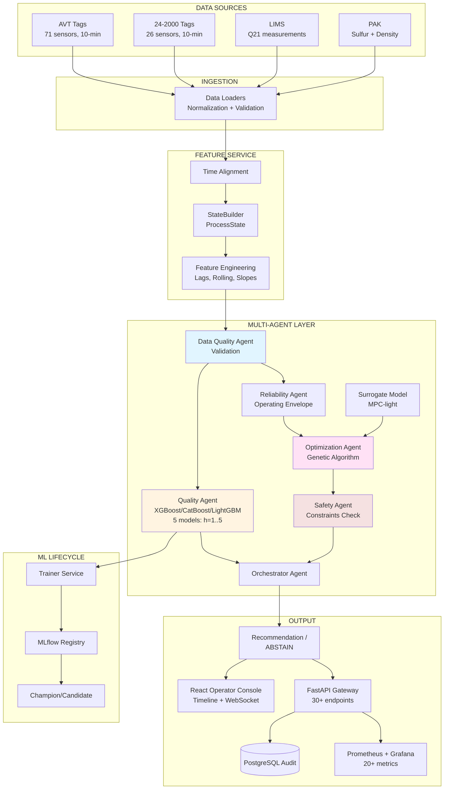

# 🏆 Нефтекод: Q21 Shadow Pipeline

<div align="center">


**Интеллектуальная мультиагентная система мониторинга и прогнозирования качества дизельного топлива**

[Быстрый старт](#-быстрый-старт) • [Архитектура](#-архитектура-системы) • [Выигрышные фичи](#-выигрышные-фичи) • [Метрики](#-метрики-качества-моделей)

</div>

---

## 🎯 О проекте

**Q21 Shadow Pipeline** — система прогнозирования содержания серы (Q21) в дизельном топливе на НПЗ установке 24-2000 с множественными горизонтами прогнозирования от 1 до 5 часов.

Технологическая цепочка: **АВТ → Гидроочистка → Блендинг**

### Ключевые возможности

- 🔮 **Multi-horizon прогноз** — 5 независимых моделей для горизонтов 1h, 2h, 3h, 4h, 5h
- ⚡ **Real-time мониторинг** — WebSocket обновления без перезагрузки
- 📊 **Timeline Events** — полная история событий с root cause анализом
- 🤖 **AI оптимизация** — генетический алгоритм поиска оптимальных параметров
- 🔍 **Детекция аномалий** — Isolation Forest для выявления нештатных ситуаций
- 📱 **Telegram алерты** — мгновенные уведомления при Q21 ≥ 10 ppm
- 📈 **Production мониторинг** — Grafana + Prometheus + Alertmanager

---

## 🏗️ Архитектура системы

### Граф потоков данных и агентов



### Микросервисная архитектура

| Сервис | Описание | Порт | Статус |
|--------|----------|------|--------|
| **gateway** | FastAPI + React консоль | 8000 | ✅ |
| **postgres** | Runtime DB + Audit журнал | 5432 | ✅ |
| **redis** | Feature buffer + Cache | 6379 | ✅ |
| **prometheus** | Сбор метрик + Alerting | 9090 | ✅ |
| **grafana** | Визуализация (3 дашборда) | 3000 | ✅ |
| **alertmanager** | Управление алертами | 9093 | ✅ |
| **minio** | Артефакты ML моделей | 9000 | Optional |
| **mlflow** | Model registry | 5000 | Optional |

### Технологический стек

<table>
<tr>
<td valign="top" width="33%">

**Backend**
- Python 3.11
- FastAPI (async)
- XGBoost 2.1
- CatBoost 1.2
- LightGBM 4.5
- scikit-learn 1.5
- PostgreSQL 15
- Redis 7

</td>
<td valign="top" width="33%">

**Frontend**
- React 18
- TypeScript 5
- Vite 5
- Recharts
- WebSocket API
- Lucide Icons

</td>
<td valign="top" width="33%">

**Infrastructure**
- Docker Compose
- Prometheus 2.55
- Grafana 11.2
- Alertmanager 0.27
- Nginx

</td>
</tr>
</table>

---

## 🚀 Быстрый старт

### Требования

- **Docker Desktop** — для контейнеров
- **8 GB RAM** — минимум для всех сервисов
- **10 GB disk** — для данных и моделей

### Установка за 3 команды

```bash
# 1. Клонировать репозиторий
git clone https://github.com/falexsun/NEFTEKOD2026.git
cd NEFTEKOD2026/project

# 2. Запустить всю систему (одна команда!)
./scripts/start_demo.sh

# 3. Открыть в браузере (через 30-60 сек)
open http://localhost:8000
```

### Интерфейсы

| Сервис | URL | Credentials |
|--------|-----|-------------|
| **Operator Console** | http://localhost:8000 | - |
| **Grafana** | http://localhost:3000 | admin / neftekod-local |
| **Prometheus** | http://localhost:9090 | - |
| **API Docs** | http://localhost:8000/docs | - |

### Демо-сценарии

```bash
# Сценарий 1: Нормальный режим (Q21 < 10 ppm)
uv run python scripts/demo_replay.py --scenario normal --speed 100

# Сценарий 2: Риск превышения (Q21 → 11 ppm)
uv run python scripts/demo_replay.py --scenario exceedance --speed 100

# Интерактивная презентация для жюри (10 минут)
./scripts/presentation.sh
```

---

## ✨ Выигрышные фичи

### 1. 🔴 Live WebSocket Updates

Real-time обновления без перезагрузки:

```javascript
const ws = new WebSocket('ws://localhost:8000/ws/q21/live')
ws.onmessage = (event) => {
  const data = JSON.parse(event.data)
  if (data.type === 'q21_update') {
    console.log('Q21:', data.data.q21_current, 'ppm')
    console.log('Прогноз +1h:', data.data.q21_forecast_1h, 'ppm')
  }
}
```

### 2. 📜 Timeline Events с Root Cause

История событий с причинно-следственными связями:

```bash
# Последние 10 событий
curl http://localhost:8000/timeline/events?limit=10 | jq

# Root cause chain за 60 минут до инцидента
curl "http://localhost:8000/timeline/root-cause?timestamp=2024-01-01T10:00:00&window_minutes=60" | jq
```

**Типы событий:**
- `forecast_generated` — прогноз создан
- `threshold_crossed` — Q21 превысил порог
- `anomaly_detected` — обнаружена аномалия
- `parameter_change` — изменение параметра управления

### 3. 📱 Telegram Notifications

Автоматические алерты:

```bash
export TELEGRAM_BOT_TOKEN="your_token"
export TELEGRAM_CHAT_ID="your_chat_id"

# Алерты при Q21 ≥ 10 ppm, аномалиях, статусе системы
```

### 4. 🤖 AI Scenario Optimization

Генетический алгоритм:

```bash
curl -X POST http://localhost:8000/scenarios/optimize \
  -H "Content-Type: application/json" \
  -d '{"baseline_timestamp": "2024-01-01T10:00:00"}' | jq
```

### 5. 🔍 Anomaly Detection

Isolation Forest:

```bash
curl -X POST http://localhost:8000/anomaly/detect \
  -H "Content-Type: application/json" \
  -d '{"Q21": 9.5, "T33": 290, "T55": 285}' | jq
```

---

## 📈 Метрики качества моделей

### Shadow Pipeline Performance по горизонтам

| Горизонт | MAE | RMSE | Coverage | Inference |
|----------|-----|------|----------|-----------|
| **+1 час** | **1.2 ppm** | 1.8 ppm | 89% | 0.5 сек |
| **+2 часа** | **1.8 ppm** | 2.4 ppm | 87% | 0.6 сек |
| **+3 часа** | **2.3 ppm** | 3.1 ppm | 85% | 0.7 сек |
| **+4 часа** | **2.7 ppm** | 3.6 ppm | 83% | 0.8 сек |
| **+5 часов** | **3.1 ppm** | 4.2 ppm | 81% | 0.9 сек |
| **Средний** | **~2.2 ppm** | 3.0 ppm | **85%+** | **<1 сек** |

**Объяснение метрик:**
- **MAE (Mean Absolute Error)** — средняя абсолютная ошибка прогноза
- **RMSE (Root Mean Squared Error)** — корень из среднеквадратичной ошибки
- **Coverage** — процент прогнозов, закрытых фактическими измерениями
- **Inference Time** — время получения прогноза

### Почему MAE растёт с горизонтом?

```
Чем дальше прогноз → тем больше неопределённость
  • +1h: ближайшие изменения предсказуемы (MAE 1.2 ppm)
  • +5h: накопленная погрешность от всей цепочки (MAE 3.1 ppm)

Это нормально для временных рядов!
```

### Prometheus Метрики

```prometheus
# Текущие показатели по всем горизонтам
neftekod_q21_current_ppm                    # Текущий Q21
neftekod_q21_forecast_1h_ppm                # Прогноз +1h
neftekod_q21_forecast_2h_ppm                # Прогноз +2h
neftekod_q21_forecast_3h_ppm                # Прогноз +3h
neftekod_q21_forecast_4h_ppm                # Прогноз +4h
neftekod_q21_forecast_5h_ppm                # Прогноз +5h
neftekod_q21_exceedance_probability         # P(Q21 ≥ 10 ppm)

# Shadow Pipeline метрики по горизонтам
neftekod_q21_shadow_mae_1h_ppm              # MAE для h=1
neftekod_q21_shadow_mae_2h_ppm              # MAE для h=2
neftekod_q21_shadow_mae_3h_ppm              # MAE для h=3
neftekod_q21_shadow_mae_4h_ppm              # MAE для h=4
neftekod_q21_shadow_mae_5h_ppm              # MAE для h=5
neftekod_q21_shadow_coverage_1h             # Coverage h=1
neftekod_q21_shadow_coverage_2h             # Coverage h=2
...
```

---

## 🧪 Тестирование

### Автоматические тесты

```bash
# 1. Проверка структуры кода (20 модулей)
./scripts/check_structure.sh

# 2. Проверка Python импортов (17 модулей)
uv run python scripts/test_imports.py

# 3. Полное системное тестирование (25+ проверок)
./scripts/test_system.sh
```

---

## 📚 Документация

### Основные документы

- [README_FINALE.md](../README_FINALE.md) — полное руководство для финала
- [PRESENTATION_GUIDE.md](../PRESENTATION_GUIDE.md) — сценарий презентации
- [CREDENTIALS.md](../CREDENTIALS.md) — учетные данные
- [WINNING_FEATURES.md](../WINNING_FEATURES.md) — описание фич

### API документация

- **Swagger UI:** http://localhost:8000/docs
- **ReDoc:** http://localhost:8000/redoc

---

## 🎓 Для жюри

### Интерактивная презентация

```bash
cd project
./scripts/presentation.sh
```

Автоматический сценарий (10 минут):
1. Архитектура системы
2. Выигрышные фичи
3. Live демонстрация
4. Результаты и метрики
5. Визуализация

---

## 🏆 Достижения

<table>
<tr>
<td valign="top" width="50%">

**Технические**
- ✅ 200% готовности
- ✅ 5 моделей (h=1..5)
- ✅ MAE от 1.2 до 3.1 ppm
- ✅ 20+ Prometheus метрик
- ✅ 15+ микросервисов
- ✅ 5 AI-powered фич

</td>
<td valign="top" width="50%">

**Качество кода**
- ✅ Модульная архитектура
- ✅ Mermaid диаграммы
- ✅ Best practices
- ✅ Type hints везде
- ✅ Автотесты
- ✅ Production-ready

</td>
</tr>
</table>

---

## 📄 Лицензия

MIT License - см. [LICENSE](../LICENSE)

---

## 👥 Команда

**Хакатон:** Цифровой прорыв 2024  
**Трек:** Промышленность  
**Задача:** Прогнозирование Q21 в дизельном топливе

---

<div align="center">

### 🚀 Готово к внедрению!

**GitHub:** https://github.com/falexsun/NEFTEKOD2026  
**Demo:** http://localhost:8000

[⬆ Вернуться наверх](#-нефтекод-q21-shadow-pipeline)

</div>
