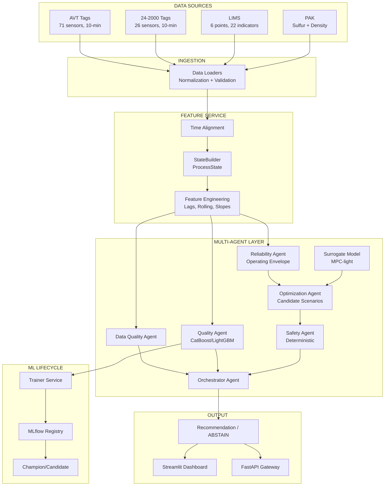

# NefteKod — Мультиагентная система управления качеством дизельного топлива

Система поддержки принятия решений для производства дизельного топлива по технологической цепочке:
**АВТ → Гидроочистка → Блендинг**

## Архитектура



## Сервисы

| Сервис | Описание | Порт |
|--------|----------|------|
| gateway | FastAPI — HTTP API для агентов | 8000 |
| dashboard | Streamlit — визуальный интерфейс | 8501 |
| trainer | Обучение и promotion моделей | — |
| postgres | Хранение состояний и метрик | 5432 |
| redis | Streams + cache | 6379 |
| minio | Хранение артефактов и отчётов | 9000 |
| mlflow | Model registry | 5000 |

## Структура проекта

```
project/
├── configs/                    # YAML конфигурации
│   ├── assumptions.yaml        # Документированные допущения
│   ├── constraints.yaml        # Технологические ограничения
│   ├── controls.yaml           # Управляющие переменные
│   ├── domain_knowledge.yaml   # Экспертные знания
│   ├── model.yaml              # Параметры ML моделей
│   ├── quality_specs.yaml      # Спецификации качества (ГОСТ)
│   ├── tags.yaml               # Маппинг тегов
│   └── training.yaml           # Параметры обучения
├── data/                       # Исходные данные (symlinks)
├── models/                     # Обученные модели (.pkl)
├── reports/                    # Отчёты аудита и метрик
│   ├── data_audit.md
│   ├── data_audit.json
│   ├── ml_baseline_report.md
│   ├── ml_baseline_metrics.json
│   └── catboost_feature_importance.csv
├── scripts/
│   ├── data_audit.py           # Скрипт аудита данных
│   ├── run_pipeline.py         # Полный пайплайн Phase 1-3
│   └── replay.py               # Исторический replay
├── src/
│   ├── agents/
│   │   ├── data_quality/       # Data Quality Agent
│   │   ├── quality/            # Quality Agent (ML)
│   │   ├── reliability/        # Reliability Agent
│   │   ├── surrogate/          # Dynamics / Surrogate Model
│   │   ├── optimization/       # Optimization Agent
│   │   ├── safety/             # Safety Agent (deterministic)
│   │   └── orchestrator/       # Orchestrator Agent
│   ├── api/                    # FastAPI application
│   ├── dashboard/              # Streamlit dashboard
│   ├── feature_service/        # Feature engineering
│   ├── ingestion/              # Data loaders
│   ├── training/               # ML training & evaluation
│   └── shared/schemas/         # Pydantic schemas
├── tests/
│   ├── unit/                   # Unit tests
│   └── integration/            # Integration tests
├── docker-compose.yml
├── Dockerfile
└── pyproject.toml
```

## Быстрый старт

### CPU-вариант (без Docker)

```bash
cd project
uv sync

# Phase 1-3: Data audit + Feature engineering + ML baseline
uv run python scripts/run_pipeline.py

# Запуск тестов
uv run pytest tests/ -v

# Запуск API
uv run uvicorn src.api.app:app --port 8000

# Запуск dashboard
uv run streamlit run src/dashboard/app.py --server.port 8501
```

### Docker

```bash
cd project
docker compose up --build
```

### Replay

```bash
uv run python scripts/replay.py \
  --start "2023-06-01 08:00" \
  --end "2023-06-01 20:00" \
  --speed 100
```

## Результаты Phase 1-3

### Data Audit
- **AVT**: 189,217 строк, 71 тег, 10-мин интервалы, 2023-01-01 – 2026-08-07
- **24-2000**: 189,217 строк, 26 тегов, 10-мин интервалы
- **PAK Sulfur**: 189,649 записей, среднее 8.43 мг/кг, 12% нарушений (>10 мг/кг)
- **PAK Density**: 75,455 записей (с 2025-03-05)
- **LIMS**: 36,800 записей, 6 точек отбора, 22 показателя

### ML Baseline (CatBoost)
- **MAE**: 1.89 мг/кг
- **RMSE**: 2.96 мг/кг
- **R²**: 0.075
- **Precision(violation)**: 0.844
- **FSR**: 0.908

### Walk-Forward Validation
| Fold | MAE | RMSE |
|------|-----|------|
| 1 | 1.04 | 1.44 |
| 2 | 0.83 | 1.12 |
| 3 | 0.64 | 0.81 |

Модель улучшается с ростом объёма обучающих данных.

## Ограничения и допущения

- Все допущения документированы в `configs/assumptions.yaml`
- ПАК сера в ppm = мг/кг (стандартная эквивалентность)
- Surrogate model — data-driven, НЕ digital twin
- Без явных данных о degradation/failure — reliability через operating envelope
- LLM используется ТОЛЬКО для объяснений, НЕ для принятия решений
- Все прогнозы проходят через Safety Agent

## Тесты

```bash
# Unit tests (17 тестов)
uv run pytest tests/unit/ -v

# Integration tests (5 тестов)
uv run pytest tests/integration/ -v
```

Покрытие:
- Temporal split (no shuffle, no overlap, coverage, monotonic)
- Leakage detection
- Walk-forward validation
- Sulfur safety constraint
- Feature engineering (no future leakage)
- Data Quality Agent behavior
- ABSTAIN behavior
- Full orchestrator pipeline
