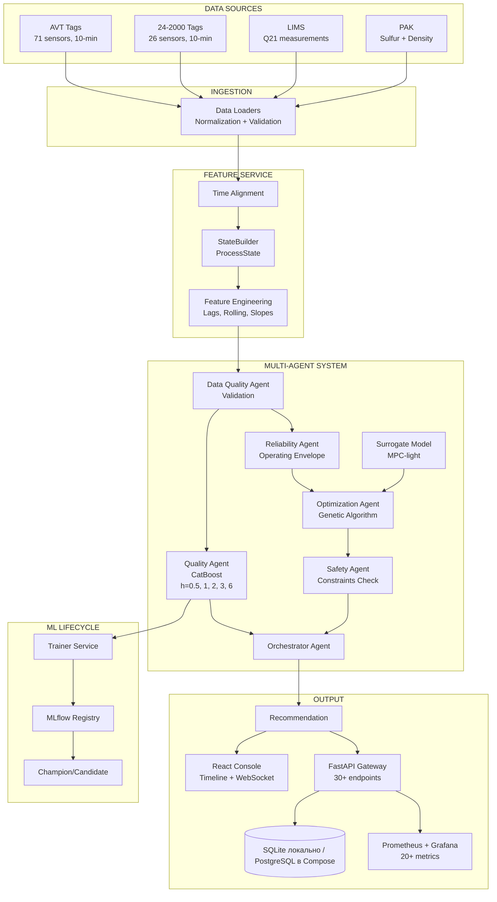
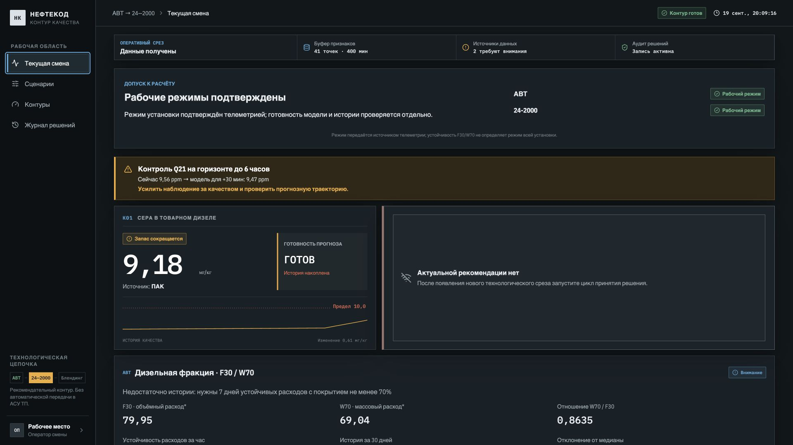
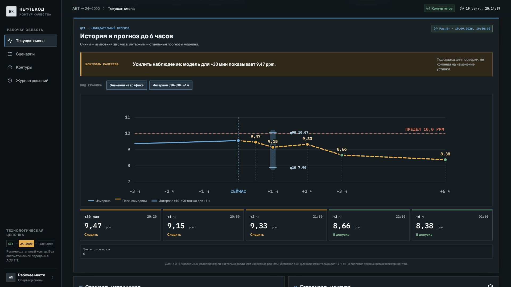
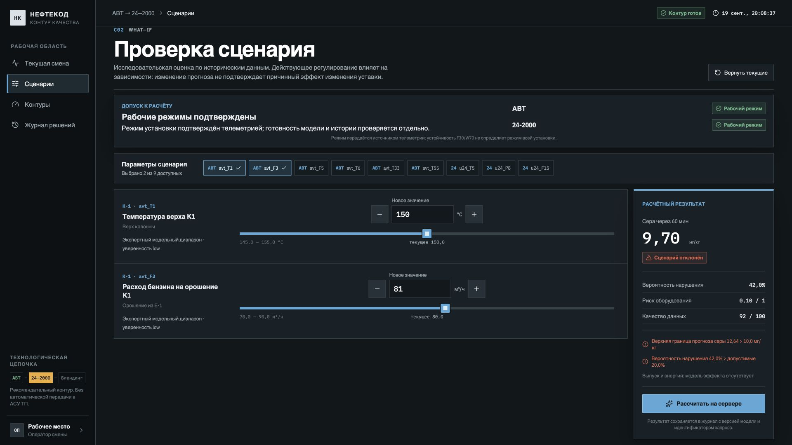
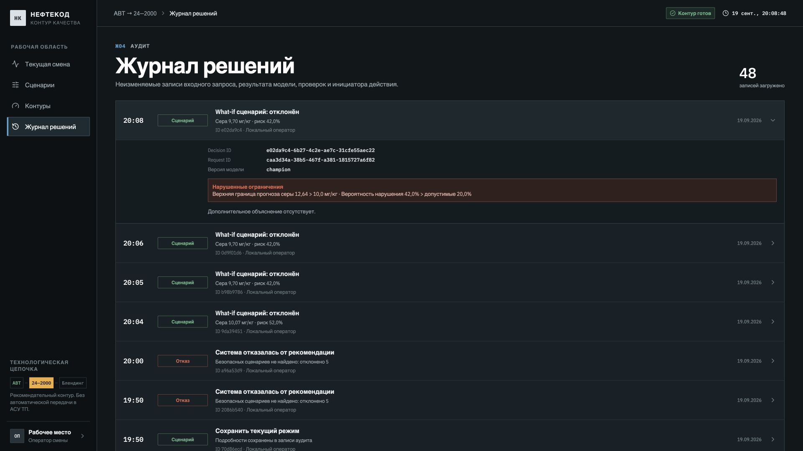
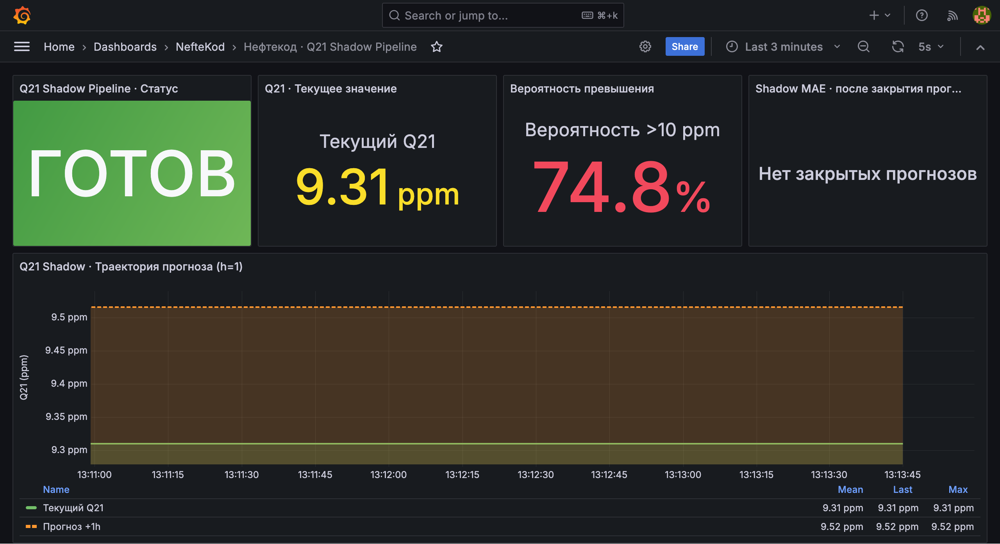
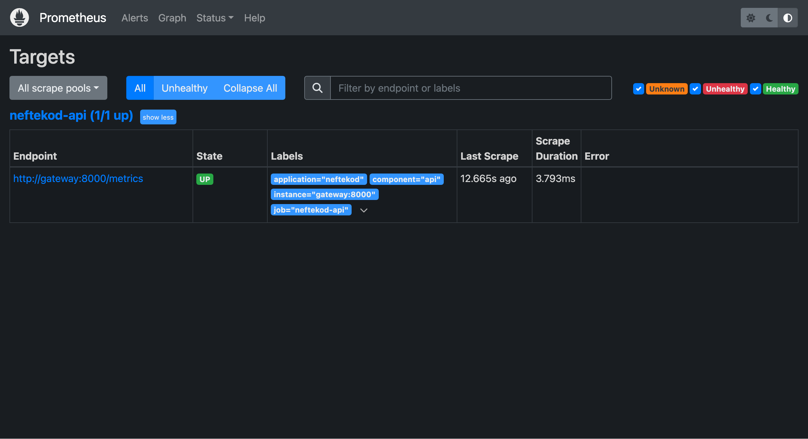
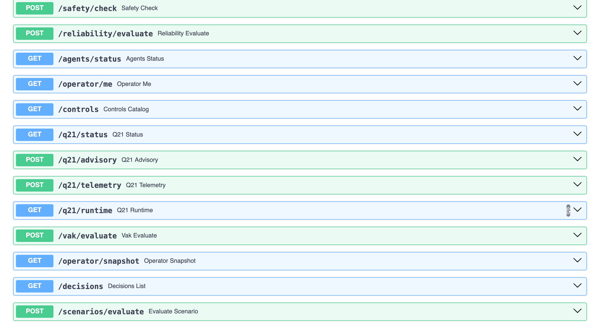

# Нефтекод: Q21 Shadow Pipeline

<div align="center">


**Мультиагентная система прогнозирования качества дизельного топлива**

| Горизонт прогноза | MAE |
|-------------------|-----|
| 0,5 часа | 0,574 ppm |
| 1 час | 0,725 ppm |
| 2 часа | 1,148 ppm |
| 3 часа | 1,312 ppm |
| 6 часов | 1,571 ppm |

[Быстрый старт](#быстрый-старт) • [Архитектура](#архитектура-системы) • [Метрики](#метрики-качества-моделей) • [Документация](#документация)

</div>

---

## О проекте

**Q21 Shadow Pipeline** — система теневого прогнозирования содержания серы (Q21) в дизельном топливе на установке 24-2000 с горизонтами от 30 минут до 6 часов. Расчёты не передают уставки в АСУ ТП.

Технологическая цепочка: **АВТ → Гидроочистка → Блендинг**

### Возможности

- Multi-horizon прогноз — 5 горизонтов: 0,5; 1; 2; 3; 6 часов
- Real-time мониторинг — WebSocket обновления без перезагрузки
- Timeline Events — полная история событий с root cause анализом
- AI оптимизация — генетический алгоритм поиска оптимальных параметров
- Детекция аномалий — Isolation Forest для выявления нештатных ситуаций
- Telegram алерты — мгновенные уведомления при Q21 ≥ 10 ppm
- Production мониторинг — Grafana + Prometheus + Alertmanager

---

## Архитектура системы

### Граф потоков данных



### Микросервисы

| Сервис | Описание | Порт |
|--------|----------|------|
| gateway | FastAPI + React консоль | 8000 |
| postgres | Runtime DB + Audit журнал | 5432 |
| redis | Feature buffer + Cache | 6379 |
| prometheus | Сбор метрик + Alerting | 9090 |
| grafana | Визуализация (3 дашборда) | 3000 |
| alertmanager | Управление алертами | 9093 |

### Технологический стек

<table>
<tr>
<td valign="top" width="33%">

**Backend**
- Python 3.11
- FastAPI
- XGBoost 2.1
- CatBoost 1.2
- LightGBM 4.5
- scikit-learn 1.5
- PostgreSQL 15
- Redis 7

</td>
<td valign="top" width="33%">

**Frontend**
- React 19
- TypeScript 5
- Vite 8
- SVG-графики
- WebSocket API

</td>
<td valign="top" width="33%">

**Infrastructure**
- Docker Compose
- Prometheus 2.55
- Grafana 11.2
- Alertmanager 0.27

</td>
</tr>
</table>

---

## Быстрый старт

### Требования

- Docker Desktop
- 8 GB RAM
- 10 GB disk

### Установка

```bash
# 1. Клонировать репозиторий
git clone https://github.com/falexsun/NEFTEKOD2026.git
cd NEFTEKOD2026/project

# 2. Запустить систему
./scripts/start_demo.sh

# 3. Открыть в браузере (через 30-60 сек)
open http://localhost:8000
```

### Интерфейсы

| Сервис | URL | Credentials |
|--------|-----|-------------|
| Operator Console | http://localhost:8000 | - |
| Grafana | http://localhost:3000 | admin / neftekod-local |
| Prometheus | http://localhost:9090 | - |
| API Docs | http://localhost:8000/docs | - |

### Демо-сценарии

```bash
# Сценарий 1: Нормальный режим (Q21 < 10 ppm)
uv run python scripts/demo_replay.py --scenario normal --speed 100

# Сценарий 2: Риск превышения (Q21 → 11 ppm)
uv run python scripts/demo_replay.py --scenario exceedance --speed 100

# Интерактивная презентация для жюри (10 минут)
./scripts/presentation.sh
```

---

## Как система помогает смене

Оператору важно не количество моделей, а ответ на три вопроса: что происходит
с качеством топлива сейчас, есть ли риск выхода за предел и что даст изменение
режима. Консоль собирает эти ответы в одном рабочем процессе.

1. **Оценить состояние.** Экран «Текущая смена» показывает последнее значение
   Q21, прогнозную траекторию, свежесть данных и готовность расчёта. Если
   история не накоплена или модель недоступна, система показывает причину
   вместо вымышленного прогноза.
2. **Проверить действие.** В «Сценариях» можно изменить управляемые параметры
   и сравнить расчёт с исходным режимом. Проверка учитывает ограничения, но
   сама не меняет уставки установки.
3. **Разобрать решение.** «Журнал решений» сохраняет результаты расчётов и
   контекст, чтобы следующая смена могла восстановить, на каких данных и
   какой версии модели была основана рекомендация.

Grafana и Prometheus остаются инженерным контуром наблюдаемости; они не
подменяют операторский экран и не управляют технологическим процессом.

### Сценарий работы в интерфейсе

Полноэкранные снимки 1920 × 1080 ниже сделаны на **изолированной SQLite-базе и
синтетической телеметрии**. Они показывают путь пользователя и защитные состояния
интерфейса, а не фактические показания установки или подтверждённую
технологическую рекомендацию.

1. **Смена:** оператор видит измерение ПАК, готовность моделей, режимы
   установки и свежесть источников. При отсутствии актуального решения экран
   прямо пишет, что рекомендации нет.

   

2. **Теневой прогноз Q21:** график сопоставляет три часа наблюдений и пять
   независимых горизонтов моделей: +30 минут, +1, +2, +3 и +6 часов. Каждый
   горизонт показывает собственное значение и целевое время; отдельных моделей
   для +4 и +5 часов нет. На графике можно включить числовые подписи прогнозов
   и отдельно показать или скрыть интервал q10–q90 для +1 часа; настройки
   сохраняются в браузере. Для остальных горизонтов модель границы интервала
   пока не выдаёт. Операторская подсказка выводится из порогов прогноза,
   а не из модели безопасного изменения уставки. Старый прогноз помечается
   архивным и не превращается в оперативное предупреждение.

   

3. **What-if:** оператор выбирает параметр и меняет его в допустимом модельном
   диапазоне. Сервер проверяет сценарий: при точечном прогнозе 9,70 мг/кг
   пример отклонён, поскольку верхняя граница 12,64 мг/кг и вероятность
   нарушения 42% превышают допустимые значения. Изменение параметра не
   отправляется в АСУ ТП.

   

4. **Аудит:** расчёт и причина отказа сохраняются с идентификаторами запроса и
   решения, версией модели и нарушенным ограничением.

   

Если нет полной истории, ЛИМС или сигнала в модельном диапазоне, сценарный
расчёт блокируется. Это безопасный отказ, а не сбой интерфейса.

### Инженерный мониторинг и API

Эти снимки сделаны в отдельном запущенном Compose-стенде. Для Grafana в API
передана **синтетическая** 24-часовая история Q21; это проверка пути
«телеметрия → прогноз → метрики → дашборд», а не реальные показатели завода.

- **Grafana:** статус моделей, текущий Q21, оценка риска и часовой прогноз.
  Пока прогнозы не закрыты фактическим измерением, MAE честно показывает
  «Нет закрытых прогнозов», а не нулевую ошибку.

  

- **Prometheus:** цель `neftekod-api` доступна (`UP`), метрики считываются с
  `/metrics` работающего API.

  

- **HTTP API:** OpenAPI-документация (Swagger UI) содержит маршруты готовности моделей,
  приёма Q21, сценариев и журнала решений.

  

---

## Метрики качества моделей

### Shadow Pipeline Performance по горизонтам

| Горизонт прогноза | MAE на офлайн-оценке |
|-------------------|---------------------|
| 0,5 часа | 0,574 ppm |
| 1 час | 0,725 ppm |
| 2 часа | 1,148 ppm |
| 3 часа | 1,312 ppm |
| 6 часов | 1,571 ppm |

**Baseline сравнение (последнее значение):** Наивный прогноз «Q21 через час = текущее Q21» даёт MAE ~1.2 ppm на горизонте 1 час (тестовая выборка, аналогичная валидации модели). Улучшение модели CatBoost составляет **~40%** (0.725 vs 1.2 ppm). При увеличении горизонта прогноза модель сохраняет преимущество, поскольку последнее значение не учитывает динамику технологических параметров (F30, T33, T55) и тренды процесса.

Источники: [результаты multi-horizon](project/models/manifests/multihorizon_results.json)
и [описание основной часовой модели](project/reports/production_pipeline_2026-09-16.md).
Это офлайн-оценка моделей, а не текущая ошибка онлайн-потока. Для интервала q10–q90 на горизонте
1 час в эксперименте указано покрытие 77,3% при номинальных 80%; онлайн-метрики
появляются только после закрытия прогноза фактическим измерением.

Метрики:
- **MAE** — средняя абсолютная ошибка прогноза
- **Покрытие интервала** — доля фактических значений внутри прогнозного интервала

### Дообучение по подтверждённым результатам ЛИМС

Для часовой модели серы АВТ → 24—2000 добавлен отдельный контур подготовки
модели-кандидата: [retrain_lims.py](project/scripts/retrain_lims.py). Исходный
`catboost_champion.pkl` обучался на сере **ПАК**, а новый кандидат адаптируется
к сере **ЛИМС** — это смена целевого измерения, а не доказанное улучшение
действующей модели на её прежней метрике. Контур берёт
только результаты выбранного показателя ЛИМС с корректной отметкой времени,
неповторяющуюся лабораторную пробу, полный технологический срез и шесть часов
непрерывной 10-минутной истории признаков. Признаки берутся **за час до времени
пробы**; ЛИМС-результат и будущие измерения в них не попадают. Свежесть
показателей проверяется по времени источника (`avt`, `u24`, `lims`,
`pak_density`), поэтому повтор устаревшего значения в новой записи не считается
новым измерением. При необходимости
можно потребовать дополнительные показатели лабораторной панели через
`--required-lims-field`. Разные показатели серы не смешиваются в одну цель.

Причина обновлять модели — обнаруженный временной дрейф: в
[анализе параметров](docs/DEEP_ANALYSIS_FINDINGS.md) значимо менялись **8 из 50
тегов (16%)**; там же рекомендован горизонт не более трёх месяцев без
переобучения. **16% — доля дрейфующих тегов, а не доказанное улучшение MAE**.
Кандидата разумно проверять по мере накопления ЛИМС и не реже одного раза в
три месяца, но запускать обучение без достаточного числа новых проб нельзя.
Для ограничения памяти в одной попытке используется не более 90 последних
суток с восьмичасовым запасом на историю признаков.

```bash
cd project
# Подставьте документированное UTC-время конца обучающей выборки champion.
uv run python scripts/retrain_lims.py \
  --champion-trained-through "$CHAMPION_TRAINED_THROUGH" \
  --target lims_sulfur_avg
```

Требуются минимум 30 **новых после обучения champion** полных ЛИМС-проб:
не менее 20 для дообучения и не менее 10 более поздних для проверки. Модель
CatBoost дообучается от текущего champion, а обе версии сравниваются на одном
временном holdout с временным зазором между обучающими метками и первым
проверочным прогнозом — по MAE, RMSE и пропущенным превышениям 10 мг/кг. Если в
holdout меньше трёх превышений или меньше трёх нормальных проб, пригодность к
выпуску не подтверждается. Отчёт и
кандидат сохраняются отдельно в `project/reports/lims_retraining/`;
**работающая модель не заменяется автоматически**. Для продвижения нужны
проверка инженера, сверка определения ПАК/ЛИМС, зафиксированная дата обучения
champion и регламент отката.
Этот контур не дообучает наблюдательные модели Q21 на `.cbm`.

В текущей локальной SQLite-базе нет новых технологических срезов и ЛИМС-проб,
поэтому фактический кандидат здесь пока не обучен. Скрипт в таком случае
записывает причину отказа вместо мнимого улучшения.

### Prometheus Метрики

```prometheus
# Оперативное состояние
neftekod_q21_current_ppm
neftekod_q21_forecast_1h_ppm
neftekod_q21_exceedance_probability
neftekod_q21_buffer_points
neftekod_q21_data_freshness_minutes
neftekod_q21_shadow_ready

# Агрегаты по закрытым прогнозам
neftekod_q21_shadow_mae_ppm
neftekod_q21_shadow_coverage
neftekod_q21_shadow_predictions_total
neftekod_q21_shadow_closed_total
```

---

## Тестирование

### Автоматические тесты

```bash
cd project
uv run python -m pytest -q
npm --prefix frontend ci
npm --prefix frontend run build
```

Интеграцию контейнеров проверяйте отдельно после `docker compose up`: тесты
Python и сборка фронтенда не доказывают готовность PostgreSQL, Redis, Grafana
или промышленного источника телеметрии.

---

## Документация

### Основные документы

- [README проекта](project/README.md) — архитектура и запуск приложения
- [Справочник тегов](docs/neftekod_tag_descriptions.md) — параметры установки
- [EDA](eda/README.md) — исследование данных и результаты экспериментов

### API документация

- **Swagger UI:** http://localhost:8000/docs
- **ReDoc:** http://localhost:8000/redoc

---

## Демонстрация

```bash
cd project
./scripts/presentation.sh
```

Для показа достаточно пройти путь оператора: текущая смена → проверка
сценария → запись в журнале. Если нет потока данных, интерфейс должен явно
показать состояние недоступности, а не подставить демонстрационные значения.

---

<div align="center">

**GitHub:** https://github.com/falexsun/NEFTEKOD2026

[Вернуться наверх](#нефтекод-q21-shadow-pipeline)

</div>
