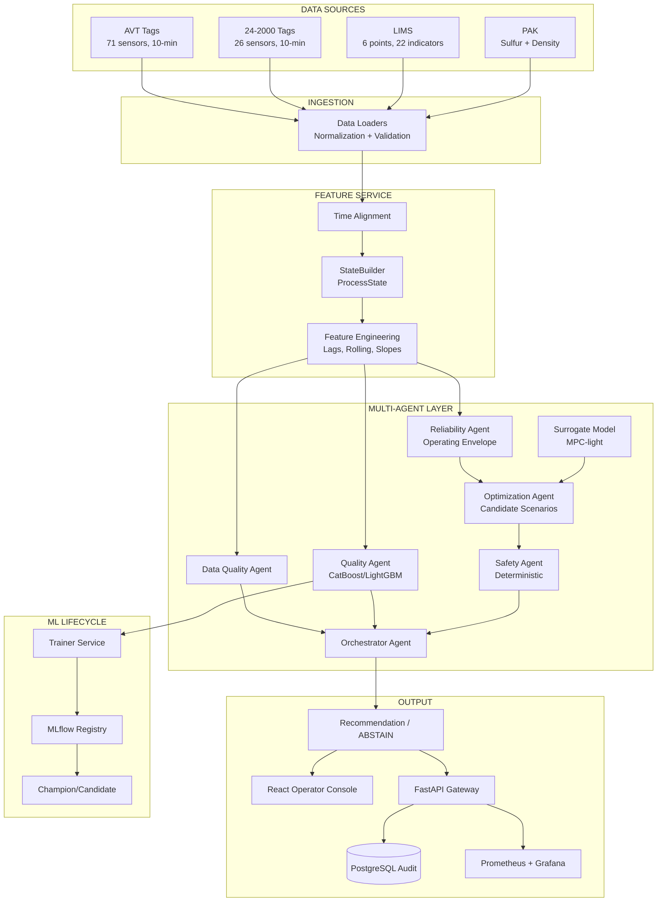

# NefteKod — Мультиагентная система управления качеством дизельного топлива

Система поддержки принятия решений для производства дизельного топлива по технологической цепочке:
**АВТ → Гидроочистка → Блендинг**

## Архитектура



## Сервисы

| Сервис | Описание | Порт |
|--------|----------|------|
| gateway | FastAPI + собранная React-консоль | 8000 |
| trainer | Обучение и promotion моделей | — |
| postgres | Телеметрия и неизменяемый журнал решений | 5432 |
| redis | Streams + cache | 6379 |
| minio | Хранение артефактов и отчётов | 9000 |
| mlflow | Model registry | 5000 |
| prometheus | Метрики и правила алертинга | 9090 |
| grafana | Инженерные dashboards | 3000 |
| alertmanager | Состояние и маршрутизация тревог | 9093 |

## Структура проекта

```
project/
├── configs/                    # YAML конфигурации
│   ├── assumptions.yaml        # Документированные допущения
│   ├── constraints.yaml        # Технологические ограничения
│   ├── controls.yaml           # Управляющие переменные
│   ├── domain_knowledge.yaml   # Экспертные знания
│   ├── model.yaml              # Параметры ML моделей
│   ├── quality_specs.yaml      # Спецификации качества (ГОСТ)
│   ├── tags.yaml               # Маппинг тегов
│   └── training.yaml           # Параметры обучения
├── data/                       # Исходные данные подключаются отдельно
├── models/                     # Обученные модели (.pkl)
├── reports/                    # Отчёты аудита и метрик
│   ├── data_audit.md
│   ├── data_audit.json
│   ├── ml_baseline_report.md
│   ├── ml_baseline_metrics.json
│   └── catboost_feature_importance.csv
├── scripts/
│   ├── data_audit.py           # Скрипт аудита данных
│   ├── run_pipeline.py         # Полный пайплайн Phase 1-3
│   └── replay.py               # Исторический replay
├── src/
│   ├── agents/
│   │   ├── data_quality/       # Data Quality Agent
│   │   ├── quality/            # Quality Agent (ML)
│   │   ├── reliability/        # Reliability Agent
│   │   ├── surrogate/          # Dynamics / Surrogate Model
│   │   ├── optimization/       # Optimization Agent
│   │   ├── safety/             # Safety Agent (deterministic)
│   │   └── orchestrator/       # Orchestrator Agent
│   ├── api/                    # FastAPI, RBAC и runtime store
│   ├── dashboard/              # Legacy-код, не запускается Compose
│   ├── feature_service/        # Feature engineering
│   ├── ingestion/              # Data loaders
│   ├── training/               # ML training & evaluation
│   └── shared/schemas/         # Pydantic schemas
├── tests/
│   ├── unit/                   # Unit tests
│   └── integration/            # Integration tests
├── docker-compose.yml
├── Dockerfile
└── pyproject.toml
```

## Быстрый старт

### CPU-вариант (без Docker)

```bash
cd project
uv sync

# Phase 1-3: Data audit + Feature engineering + ML baseline
uv run python scripts/run_pipeline.py

# Запуск тестов
uv run pytest tests/ -v

# Запуск API
uv run uvicorn src.api.app:app --port 8000

# Сборка операторской консоли (React + TypeScript)
cd frontend
npm ci
npm run build
cd ..

# Запуск API и собранной консоли на http://localhost:8000
uv run uvicorn src.api.app:app --port 8000

# Режим разработки интерфейса (API должен работать на :8000)
cd frontend && npm run dev
```

### Мониторинг: Prometheus + Grafana

```bash
# Для локальной разработки задайте собственный пароль администратора.
export GRAFANA_ADMIN_PASSWORD='change-me'
docker compose --profile monitoring up -d --build
```

Если порт `8000` занят, добавьте перед командой
`NEFTEKOD_GATEWAY_PORT=8011` — внутри Docker адрес для Prometheus останется
`gateway:8000`.

- Grafana: http://localhost:3000 — dashboards **Состояние системы** и **Технологический контур**
- Prometheus: http://localhost:9090
- Alertmanager: http://localhost:9093
- Метрики FastAPI: http://localhost:8000/metrics

Логин Grafana по умолчанию — `admin`. Локальный резервный пароль из Compose —
`neftekod-local`; вне локальной среды обязательно задайте `GRAFANA_ADMIN_PASSWORD`.

### Авторизация и роли

По умолчанию локальная авторизация выключена. Для защищённого контура включите
её и задайте отдельные секреты:

```bash
export NEFTEKOD_AUTH_ENABLED=true
export NEFTEKOD_OPERATOR_API_KEY='...'
export NEFTEKOD_ENGINEER_API_KEY='...'
export NEFTEKOD_ADMIN_API_KEY='...'
```

Оператор может читать рабочий срез и выполнять рекомендательный what-if.
Инженер может подавать телеметрию и использовать диагностические endpoints.
Только администратор может сбрасывать runtime-состояние. В браузере ключ хранится
в `sessionStorage` и удаляется при закрытии вкладки.

### Операторские API

- `GET /operator/snapshot` — единый оперативный срез и свежесть источников;
- `GET /controls` — серверный реестр всех управляемых параметров;
- `POST /scenarios/evaluate` — проверяемый моделью what-if расчёт;
- `GET /decisions` — журнал решений и сценариев;
- `GET /ready` — модель, история, схема, surrogate и хранилище.
- `GET /q21/status` — проверенные модели, горизонты и uncertainty;
- `GET /q21/runtime` — прогрев потока, последний прогноз и shadow-метрики;
- `POST /q21/telemetry` — инженерная подача одной 10-минутной точки с автоматическим shadow-inference;
- `POST /q21/advisory` — ручная проверка пакета из 145–1000 точек без передачи уставок.

Для повторяемых запросов передавайте стабильный `X-Request-ID`: повторная отправка
вернёт уже сохранённый результат без повторного добавления телеметрии или расчёта.

При недоступности модели или неполной истории интерфейс работает по принципу
безопасного отказа: показывает причину и не генерирует демонстрационные значения.

### Docker

```bash
cd project
docker compose up --build
```

### Replay

```bash
uv run python scripts/replay.py \
  --start "2023-06-01 08:00" \
  --end "2023-06-01 20:00" \
  --speed 100
```

Replay публикует объединённые события в Redis Stream `telemetry.received`.
Сервис `q21-stream-worker` читает их через consumer group, преобразует данные
24-2000 в контракт `/q21/telemetry` и подтверждает событие только после успешной
записи API. Некорректные сообщения перемещаются в `telemetry.q21.dlq`, а
неподтверждённые после сбоя автоматически захватываются повторно через 60 секунд.

## Результаты Phase 1-3

### Data Audit
- **AVT**: 189,217 строк, 71 тег, 10-мин интервалы, 2023-01-01 – 2026-08-07
- **24-2000**: 189,217 строк, 26 тегов, 10-мин интервалы
- **PAK Sulfur**: 189,649 записей, среднее 8.43 мг/кг, 12% нарушений (>10 мг/кг)
- **PAK Density**: 75,455 записей (с 2025-03-05)
- **LIMS**: 36,800 записей, 6 точек отбора, 22 показателя

### ML Baseline (CatBoost)
- **MAE**: 1.89 мг/кг
- **RMSE**: 2.96 мг/кг
- **R²**: 0.075
- **Precision(violation)**: 0.844
- **FSR**: 0.908

### Walk-Forward Validation
| Fold | MAE | RMSE |
|------|-----|------|
| 1 | 1.04 | 1.44 |
| 2 | 0.83 | 1.12 |
| 3 | 0.64 | 0.81 |

Модель улучшается с ростом объёма обучающих данных.

## Ограничения и допущения

- Все допущения документированы в `configs/assumptions.yaml`
- ПАК сера в ppm = мг/кг (стандартная эквивалентность)
- Surrogate model — data-driven, НЕ digital twin
- Без явных данных о degradation/failure — reliability через operating envelope
- LLM используется ТОЛЬКО для объяснений, НЕ для принятия решений
- Все прогнозы проходят через Safety Agent

## Тесты

```bash
# Unit tests (17 тестов)
uv run pytest tests/unit/ -v

# Integration tests (5 тестов)
uv run pytest tests/integration/ -v
```

Покрытие:
- Temporal split (no shuffle, no overlap, coverage, monotonic)
- Leakage detection
- Walk-forward validation
- Sulfur safety constraint
- Feature engineering (no future leakage)
- Data Quality Agent behavior
- ABSTAIN behavior
- Full orchestrator pipeline
# Q21 shadow pipeline

Проверенный прогноз на пять горизонтов доступен через `POST /q21/advisory`; состояние артефактов — через `GET /q21/status`. Потоковый режим принимает по одной точке через `POST /q21/telemetry`, хранит последние 145 точек, автоматически запускает shadow-inference после прогрева и закрывает прогнозы фактическим Q21 на соответствующем горизонте. `GET /q21/runtime` отдаёт последнюю траекторию, MAE и coverage. Запрос требует последовательных 10-минутных точек и явно объявленный режим установки. Модели проверяются по SHA-256 при запуске. Физические формулы ВАК доступны через `POST /vak/evaluate`.

Контур работает только как read-only advisory: результат не является причинной оценкой и не передаёт уставки в АСУ ТП. Подробный разбор ограничений: `reports/production_pipeline_2026-09-16.md`.
